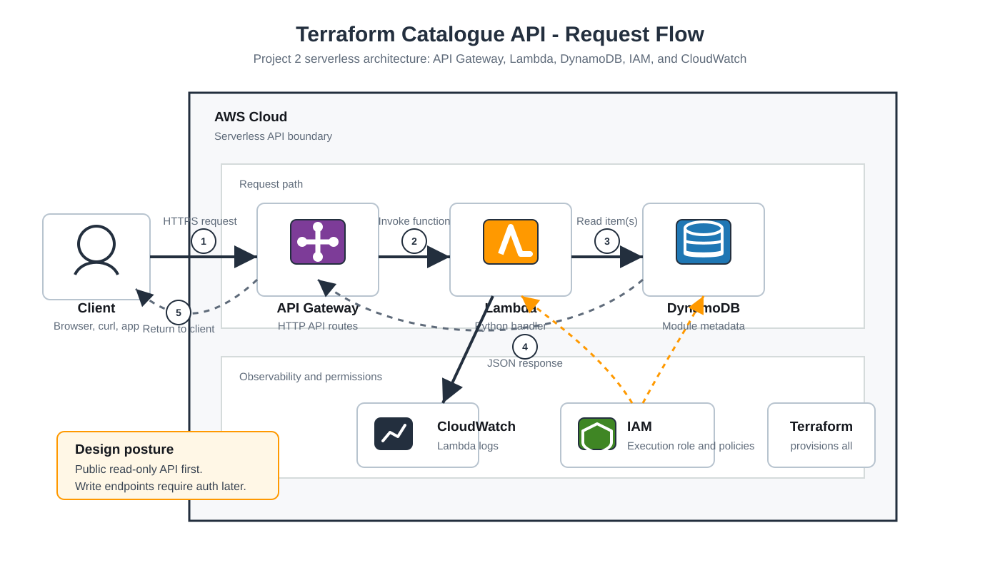

# Request Flow Diagram

This diagram shows the conceptual request flow for the Terraform Catalogue API.



## Flow

1. A client sends an HTTPS request to API Gateway.
2. API Gateway matches the route and invokes Lambda.
3. Lambda reads module metadata from DynamoDB.
4. Lambda formats a JSON response.
5. API Gateway returns the response to the client.

## Supporting Services

- IAM grants Lambda permission to read DynamoDB and write logs.
- CloudWatch stores Lambda logs for debugging.
- Terraform provisions the AWS resources.

## Design Notes

The first API version is public and read-only:

```text
GET /modules
GET /modules/{id}
```

Write endpoints are intentionally deferred until authentication and authorization are designed.
